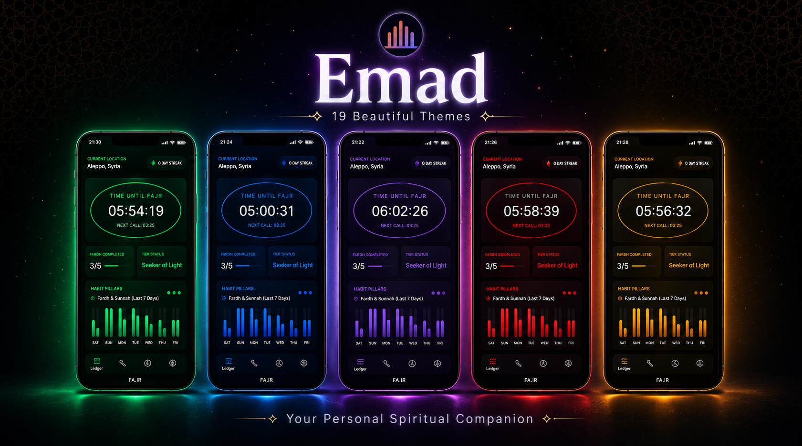

# Emad 🌌
A highly polished, celestial-glassmorphic Islamic prayer and Qada tracker engineered with Kotlin and Jetpack Compose.

## 💡 The Story Behind Emad

Most modern Islamic prayer applications suffer from the same fundamental issues: they are cluttered with intrusive ads, bogged down by third-party data tracking, or trapped in outdated design philosophies from a decade ago. Keeping up with your spiritual habits shouldn't feel like navigating a bloated corporate utility app.

Emad was born out of a desire for something better—a seamless, completely private, and visually stunning companion. Built from the ground up around clean glassmorphic design languages, fluid micro-interactions, and intentional habit mechanics, it shifts the focus entirely back to personal mindfulness, consistency, and clear progression.

> **Note on Architecture:** This app was entirely designed, architected, and engineered through precise orchestration and prompt streaming inside Google AI Studio utilizing the Gemini 3.5 Flash model.

---

## 📲 Direct Download & Installation

You don't need to configure complex developer tools or compile code locally to start tracking. 

1. Navigate to the **[Releases](https://github.com/SuperGamer2026/Emad/releases)** hub on the right-hand sidebar of this page.
2. Download the latest pre-compiled **`Emad_v1.0.apk`** directly to your Android device.
3. Open the downloaded file on your phone to install it instantly.

---

## 🔥 Key Visual & Technical Highlights

### 1. The Qada Forge & Rebuild Engine
A dedicated management hub built specifically for tracking historical missed prayers, moving far beyond basic static daily logs.
* **Target Calibration:** Establish custom recovery metrics for specific prayer windows.
* **Auto-Reset Milestones:** A persistence meter maps progression toward full recovery. Once your milestone threshold is achieved, the Forge automatically recalibrates and clears the interface for the next block.

### 2. Micro-Habit Pillars & Dashboard
The core user interface utilizes an ultra-clean layout to deliver vital context at a glance:
* **Celestial Countdown:** A fluid, centralized elliptical countdown timer tracking the exact remaining time until the next prayer call.
* **Consistency Tiers:** A gamified progression metric that dynamically updates your status (e.g., *Seeker of Light*) based on historical tracking stability.
* **Weekly Metrics Bar Chart:** A custom vertical bar layout mapping daily completion status across both Fardh (obligatory) and Sunnah prayers over a rolling 7-day canvas.

### 3. Deep Aesthetic Personalization
* **19 Premium Color Presets & App Icons:** Includes highly tailored colorways like *Expressive*, *Cosmic Noir*, and *Midnight Teal* to entirely reshape the application atmosphere alongside matching visual themes.

* **Two-Dot Unified Interface:** Theme and config selectors utilize a minimalist, matching two-dot color indicator layout across onboarding and settings menus for absolute visual consistency.
* **Dynamic Streak Milestones:** Built-in rewards track your active consistency metrics, giving you concrete, progressive achievements (*Novice Flame*, *Spark Initiate*, *Torchbearer*) to keep your tracking habits active.
* **Sensor-Driven Qibla Finder:** A beautifully integrated, smooth compass tracking system calculated directly for your coordinates with clean touch/drag simulation parameters built right in for testing.

---

## 🛠️ Tech Stack
* **Language:** Kotlin
* **UI Framework:** Jetpack Compose (Declarative UI)
* **Local Storage:** SQLite via Room Database / SharedPreferences (for theme and streak persistence)
* **State Management:** Jetpack ViewModel

---

## 📜 License
This project is open-source and licensed under the **GNU General Public License v3.0**. View the official **[LICENSE](LICENSE)** file for full terms and conditions.
